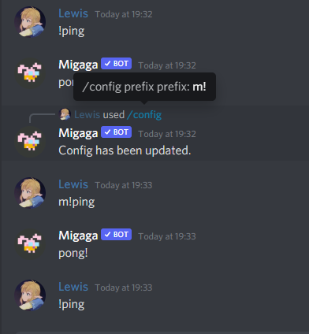

# Config Commands
The `/config` slash commands can be used to configure the bot in specific ways for your server.
All config settings are stored for the individual server you run them in.

## Getting Started
### `/config prefix <prefix>`
**Permissions**  
You must have "Manage Server" permissions to use this command.

**Prefix**  
The new prefix. This is 5 characters max and supports most characters.  
Be careful to make sure your new prefix is something your users can access easily.

**What to expect**  
Using this command will update the prefix that Migaga uses in your server.  
By default, Migaga uses `!` to respond to all commands - you can update this to avoid conflicting with other bots or to enforce a bot policy in your server.

**Example**  

### `/config points` and `/config points-emoji`
See the [Points](/features/points/) feature for more details!

### `/config logs`
See the [Server Logs](/features/server-logs/) feature for more details!
