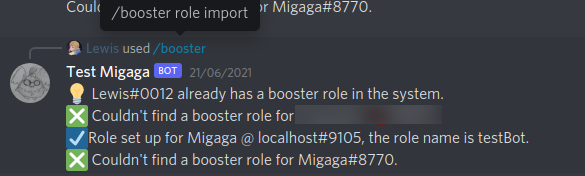
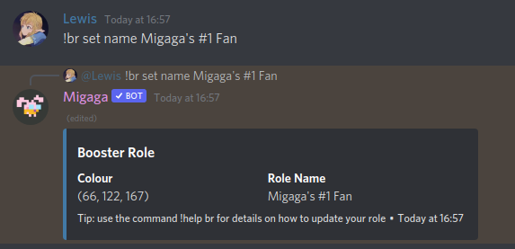

# Booster Roles
Migaga can treat your server boosters to their own custom roles that the user can set up themselves.

## Concepts
- This feature has to be enabled by an admin before it can be used. 
- Roles are automatically cleaned up and deleted if the booster stops boosting.
- Booster roles give no additional permissions, they are purely cosmetic.
- Booster roles have a concept of an "anchor role" which all new roles are placed below - for colour schemes.

## Getting Started
### `/booster role enable <enabled>`
Use this command to enable/disable booster roles in your server.

**Permissions**  
You must have the "Manage Server" permission to run this command.

**Enabled**   
True/False, if you pick "True" then booster roles will be enabled for your server members.

**What to expect**  
Once enabled, your Nitro boosters will be able to provide themselves custom roles using the [`!br`](#boosterrole-instruction-field-value) command.

### `/booster role setup <anchor role>`
**Permissions**  
You must have the "Manage Server" permission to run this command.

**Anchor Role**   
When new booster roles are created, they will be placed directly below this role.  
This is useful if your server already has colourful roles, and you want the booster role to be above it.

**What to expect**  
Your booster role will be configured for your server, and automatically booster roles will be created above the anchor role.  
If you did not provide an anchor role it will be removed. 

### `/booster role import <user>`
If your server members already had booster roles before this feature was enabled, you can use this command to add the booster roles to Migaga.

**Permissions**  
You must have the "Manage Server" permission to run this command.

**User**   
Optionally you can pick a specific user to import roles for.

**What to expect**  
Migaga will go through all members of your server who boost the server and check their roles.  
If the member has a role that belongs only to them and is below the Anchor Role (if one exists) then it will be imported for the member to manage for themselves.

### `!boosterrole <instruction> <field> <value>`
This is the command your server members can use to update their booster role.

**Aliases**  
Since this is a long command, you can use `!br` or `!myrole` instead.

**Permissions**  
You must boost the server to use this command.

**Instruction**   
Typically this will be "set".

**Field**  
The part of your booster role to update, the "name" or "colour".

**Value**  
Depending on the [field] this would be the name of your role, or the colour.

**What to expect**  
Migaga will update your booster role, and it will create one if you don't have one yet.

## Examples
  
Running the booster role import command in a server.

  
A Nitro booster using the booster role command. This updates their colour and roles.
