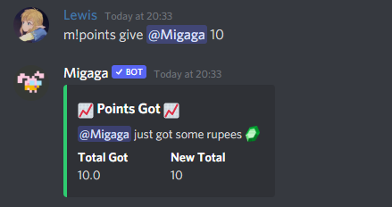
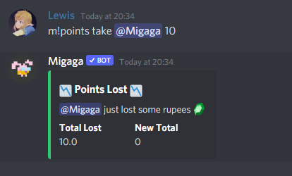

# Points System
Migaga has a points tracking system that is unique to your server.  
Points have a custom name and emoji so your server can make use of them in unique ways. 

## Concepts
- Points can be added or removed by moderators only. 
- Points are specific to your server - they cannot be shared across multiple. 
- Members of the server can gift points between each other. 
- Each server has a leaderboard. 
- Each server can have multiple custom leaderboards for role-based competitions. 

## Commands
### `/config points <points name>`
This command _must_ be run in order to use points in your server!

**Permissions**  
You must have "Manage Server" permissions to use this command.

**Points Name**  
This is the unique name for points in your server, for example - your server could call points "Rupees".

**What to expect**  
You can use this command whenever, and going forward the bot will refer to your points by that name. 
This will also enable the usage of points for your server.

### `/config points-emoji <:emoji:>`
Optionally, your points can have an emoji tied to them - to add a bit of flair to your points system.

**Permissions**  
You must have "Manage Server" permissions to use this command.

**:emoji:**  
Any emoji will do, :coin: or :star: or :dogecoins: - whatever your server wants.  
You can also leave this field empty to remove the emoji.

**What to expect**  
Messages posted by Migaga going forward relating to points will include this emoji next to the name.

### `!points <give|take> <member> <amount>`
Use this command to give or take points from a given user. 

**Permissions**  
You must have "Manage Emoji" permissions to use this command.

**Action: Give|Take**    
You can either **give** or **take** points from somebody using this command.

**Member**  
The member of the server to give points to: @Lewis#1012 or "Lewis".

**Amount**  
The total number of points to give/take in this transaction.
There is a limit to how many points you can give in one go... I hope you never find it!

**What to expect**  
Using this command will post a message for the user with the number of points provided and the number of points they now have total.

**Example**  
  
An example of giving points to a user.

  
An example of giving points to a user.  
Please note that in the example Migaga was using a [custom prefix](/features/configuration/config-commands.md).