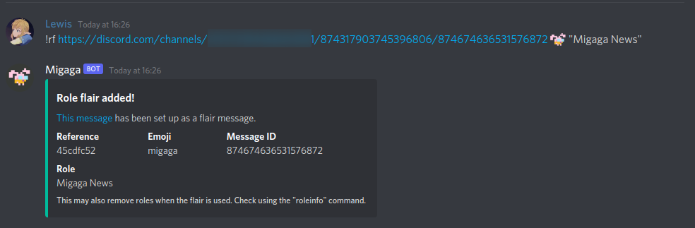
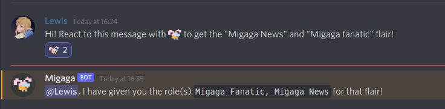
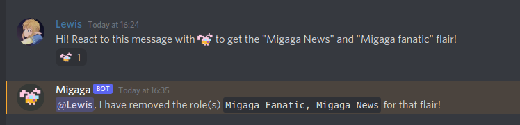

# Reaction Flairs
Reaction flairs are a quick way for people allocate themselves roles in your server.  
By clicking a reaction, they are assigned a role - removing the reaction removes the role.

## Concepts
- Any message can be set up as a reaction flair message.
- _Be Aware!_ Currently this feature only supports server emoji. This will be changed in a future update - for now using default emoji will get "Emoji not found" errors.

## Getting Started
### Help Command
For more information on reaction flairs inside Discord - use the `!help Reaction Flairs
` command.

### [Command] New reaction flair
Use this command to set up a brand new reaction flair for a message:  
`!rf <message> <emoji> <role>`

**Permissions**  
You must have the "Manage Roles" permission to run this command.

**Message**   
The message that should be set up with this reaction. _This should be the message link!_   
For instructions on how to get a message link, read the [Discord Docs](https://support.discord.com/hc/en-us/articles/206346498-Where-can-I-find-my-User-Server-Message-ID-). 

**Emoji**  
This is the emoji the user must react with in order to get the role. Make sure to use a server emoji.

**Role**   
The role that the user will get by clicking the reaction. You can do @Role, the Role ID or "Role Name". If the bot cannot detect the role, try using the ID.

**What to expect**  
Once this command has been run, Migaga will automatically react to the message so that it is clear what your server members should do.

### [Command] Getting reaction flairs for a message
To see all reaction flairs that have been set up for a message:  
`!rfinfo <message>`

**Permissions**  
You must have the "Manage Roles" permission to run this command.

**Message**   
The message that should be set up with this reaction. _This should be the message link!_   
For instructions on how to get a message link, read the [Discord Docs](https://support.discord.com/hc/en-us/articles/206346498-Where-can-I-find-my-User-Server-Message-ID-).

**What to expect**  
Migaga will show you details on all reaction flairs set up for the message - if there is more than one, multiple messages will be posted.

### [Command] Deleting a reaction flair
`!rmrf <reference>`

**Permissions**  
You must have the "Manage Roles" permission to run this command.

**Reference**   
This is the unique reference that has been generated for your reaction flair. You can find out the reference using the [`rfinfo` command](#command-seeing-reaction-flairs-for-a-message).

**What to expect**  
Migaga will delete the reaction flair immediately. _Reactions will not be removed from the message_, reacting to the message will no longer give you that flair.

## FAQs
### Can I give more than one role per reaction?
Yes! Using the `rf` command multiple times will give/take all roles upon reacting.

### Can I remove roles using reaction flairs?
Yes! Using [role overrides](../../configuration/role-overrides.md) you can set up your reactions to remove roles when a user grabs one. 

### Can I make sure people only have one of a certain type of role?
Yes! See the same instructions as above for using role overrides. 

## Examples
### Using the flair command

### When someone reacts/unreacts
Migaga will reply to the person letting them know that their flairing has been successful. If you do not want this you can prevent Migaga from talking in that channel.    

--- 

