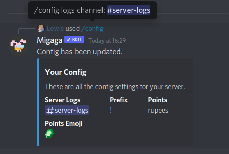
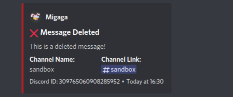

# Logging
Migaga supports logging for making sure people keep it cool in the server.

## Concepts
- Your server can have one or many log channels, just in case. 
- Logs are stored in your logs channel only, they do not get saved to Migaga.
- All logs are associated with the Discord ID of the person who caused the log entry - so you can keep tabs on repeat offenders.
- Logging is currently limited to 1 channel for all logs but in a future update we will be splitting them out.

## What is logged?
Logs were designed and updated every time somebody caused trouble in the server, logs are raised when:
- Someone joins / leaves the server.
- Changes their avatar. 
- Changes their name / nickname. 
- Edits / Deletes a message. 
- Someone is banned / unbanned.
- Roles are updated.

## Getting Started
### `/config logs <channel>`
**Permissions**  
You must have the "Manage Server" permission to run this command.

**Channel**   
Choose a channel for logs to be posted in, typically you want to ensure that only admins can see this channel.  
The channel also should not be active, due to the volume of logs that often are recorded.

**What to expect**  
Migaga will start using that channel instantly to record logs. 

## Examples
  
Using the slash command to set up a log channel.

  
An example of a deleted message being logged in the channel.