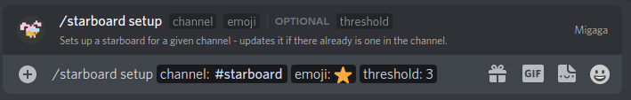
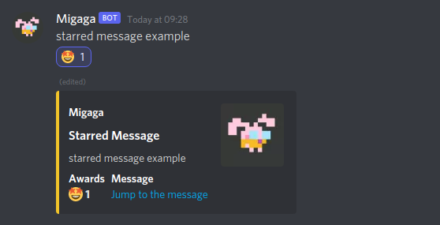

# Starboard
A starboard is a community-voted collection of the best (or worst) messages in your server.  
People can vote for messages to be included in the starboard by reacting with an emoji of your choice - once voted the message will be posted by Migaga in the configured channel.  

## Concepts
- A starboard needs a channel dedicated to it (for example #starboard).
- A starboard is connected to an emoji, whenever someone reacts to a message with that emoji it will be added to the starboard.

## Getting Started
### `/starboard setup <channel> <emoji> [threshold]`

**Permissions**  
You must have "Manage Server" permissions to use this command.

**Channel**  
This channel will be setup as a starboard channel - Migaga will prevent people from talking in it and starred messages will be posted here.

**Emoji**  
This is the emoji that is tied to the starboard. For example, if your emoji was ⭐ then reacting to a message with ⭐ would put the message in the starboard.

**Threshold**  
_Optional_ - Use this if your server is a larger one.  
Messages with reacts under this threshold will be deleted automatically after 5 minutes.

## FAQs
### Can people star their own messages?
No! Self-starred messages are ignored by the bot.

### Can I use custom emoji?
Yes! You can use any emoji for the starboard, be careful with emoji from outside your server or when deleting emoji.

### Can I have more than one starboard? 
Yes! You can have more than one starboard in your server, but only one starboard per channel.

### Can I edit my starboard?
Yes! Run the `/starboard setup` command a second time on the same channel and you can update your emoji or the reaction threshold.

## Examples
### Using the Command

### Starred Messages
  
In this example: the emoji 🤩 is being used for the starboard.
