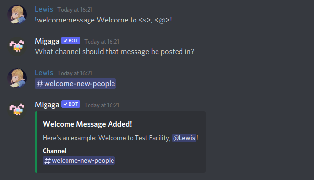
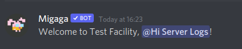
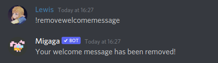
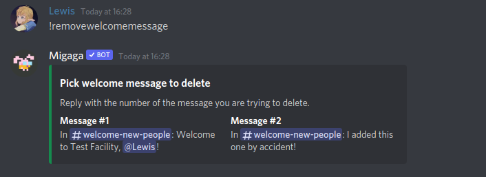

# Welcome Messages
You can configure Migaga to automatically welcome people who join your server.  
This feature was developed before Discord launched their own, but it should still be more configurable.

## Concepts
- Welcome messages can be set up in multiple channels at once, so you can use some for admins and some for your welcome channel.
- Welcome messages support placeholders, so you can add people's names or the name of your server.

## Commands
### `!welcomemessage <message>`
Use this command to set it up for your server. Migaga will then ask you which channel it should be posted in.

**Permissions**  
You must have "Manage Server" permissions to use this command.

**Message**  
The message to be posted by the bot when somebody joins the server. 
**Placeholders:** Use `<@>` for user mention, `<>` for user name, and `<s>` for the server name.

**What to expect**  
You can use this command whenever, and going forward the bot will refer to your points by that name.
This will also enable the usage of points for your server.

**Examples**  
  
An example of how to set up the welcome message.

  
An example of what happens when somebody joins the server.

### `!removewelcomemessage`
Use this command to delete welcome messages you no longer need.

**Aliases**
Since this is a long command, there are a few aliases to make it easier to remember/type.
`rmwm`, `deletewelcome`, `removewm`

**Permissions**  
You must have "Manage Server" permissions to use this command.

**What to expect**  
Migaga will show you some of the welcome messages that your server has, where you can pick which ones you would like to delete.
If you only have one welcome message then it will be deleted straight away.

**Examples**  
  
Deleting a welcome message when you've only got one set up.

  
Deleting a welcome message if you have more than one in your server.